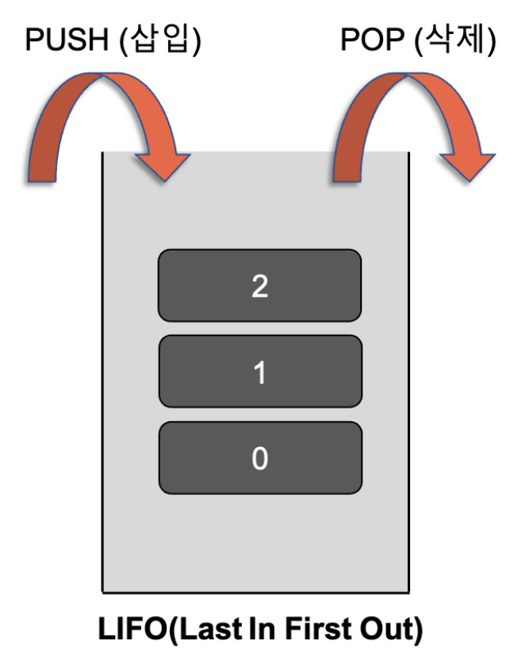

스택, 큐
========================
## 스택(Stack)
- 접시를 쌓듯이 자료를 차곡차곡 쌓아올린 형태의 자료구조 
- top 위치의 원소에만 접근이 가능 -> 마지막에 삽입한 원소가 가장 먼저 삭제 되는 후입선출구조 (Last-In-First-Out, LIFO)
- 용어: top, push, pop  
  push: top을 통해 삽입하는 연산   
  pop: top을 통한 삭제하는 연산 

 
  

## 큐(Queue)
- 뒤에서는 삽입만 가능하고 앞에서는 삭제만 가능한 자료구조 -> 가장 먼저 삽입된 원소가 가장 먼저 삭제되는 선입선출구조 (First-In-First-Out, FIFO)
- 용어: front, rear, enqueue, dequeue 
  enqueue: 큐의 rear에서 이루어지는 삽입연산   
  dequeue: front에서 이루어지는 삭제연산
  
 
  
  
## 데크(Deque)
- 큐 두 개를 좌우로 뒤집어서 붙인 구조로, 큐의 양쪽 끝에서 삽입과 삭제 모두를 수행할 수 있도록 확장한 자료구조 

