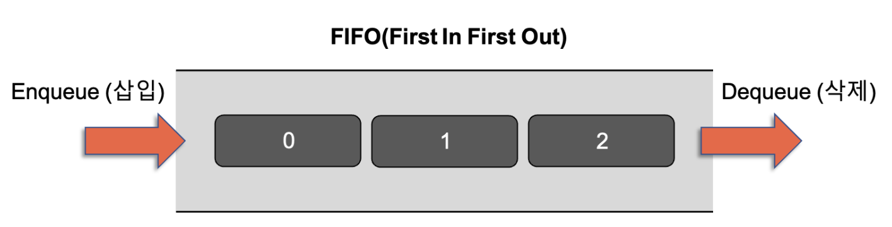

스택, 큐
========================
## 스택(Stack)
- 접시를 쌓듯이 자료를 차곡차곡 쌓아올린 형태의 자료구조 
- top 위치의 원소에만 접근이 가능 -> 마지막에 삽입한 원소가 가장 먼저 삭제 되는 후입선출구조 (Last-In-First-Out, LIFO)
- 용어: top, push, pop  
  push: top을 통해 삽입하는 연산   
  pop: top을 통한 삭제하는 연산 

 
  

## 큐(Queue)
- 뒤에서는 삽입만 가능하고 앞에서는 삭제만 가능한 자료구조 -> 가장 먼저 삽입된 원소가 가장 먼저 삭제되는 선입선출구조 (First-In-First-Out, FIFO)
- 용어: front, rear, enqueue, dequeue 
  enqueue: 큐의 rear에서 이루어지는 삽입연산   
  dequeue: front에서 이루어지는 삭제연산
  
 
  
  
## 데크(Deque)
- 큐 두 개를 좌우로 뒤집어서 붙인 구조로, 큐의 양쪽 끝에서 삽입과 삭제 모두를 수행할 수 있도록 확장한 자료구조 
- Queue와 비슷하지만 queue는 front에서만 삭제하고 end에서 삽입하는데, deque는 front와 end에서 삭제와 삽입이 모두 가능하다.
- 연속적인 메모리를 기반으로 하는 '시퀀스 컨데이너'이다. 따라서 임의 접근 반복자 제공.
- 여러 개의 메모리 단위로 데이터를 저장한다. 
- vector는 메모리를 재할당하고 모든 요소를 복사해야 되는데, deque는 새로운 메모리 단위를 할당해서 요소를 추가한다. 즉, 크기가 가변적이다.(선언 후에 변경 가능)
- 중간 요소가 삽입, 삭제될 때, 요소들을 앞/뒤로 밀 수 있으므로 vector보다는 좋은 성능을 갖는다. 
- 앞/뒤에서의 삽입/삭제 성능은 좋지만 중간에서의 삽입/삭제 성능은 좋지 않다. 

 
  
